# Homelab GitOps Infrastructure

Terraform and Ansible configuration for a Proxmox homelab. **The configuration in this repository is not a live inventory:** VMIDs and service settings may differ from the current host. Check [`docs/container-mapping.md`](docs/container-mapping.md) for the separately verified runtime inventory and configuration drift.

## Current environment

- Proxmox node: `piyushmehta`; LAN: `192.168.0.0/24`, bridge `vmbr0`, router `192.168.0.1`.
- Pi-hole (`192.168.0.23`) provides DNS only.
- Caddy is the reverse proxy. TrueNAS supplies mounted media; Jellyfin uses `/vault` for transcodes.
- Local ZFS mirror: 2 × 12 TB disks connected via native SATA.
- Live Proxmox inventory: 23 listed containers (16 running, 7 stopped); IPs and states can change.

## Infrastructure diagram

Point-in-time view of the verified layout. Dashed arrows indicate logical paths; exact Caddy upstreams and storage mount protocol are not documented here.

```mermaid
flowchart TB
    WAN((Internet)) --> ROUTER["Home Hub / router<br/>192.168.0.1"]
    CLIENTS["LAN clients"] --> ROUTER
    ROUTER -->|"LAN uplink"| BR

    subgraph HOST["Proxmox VE · piyushmehta"]
        BR["vmbr0 · 192.168.0.0/24"]
        subgraph NETWORK["Network and operations"]
            DNS["CT 105 · Pi-hole<br/>192.168.0.23 · DNS only"]
            PROXY["CT 111 · Caddy<br/>192.168.0.97 · reverse proxy"]
            VPN["CT 103 · WireGuard<br/>192.168.0.217 · tunnel 10.0.0.1/24"]
            ROUTE["CT 113 · 9router<br/>192.168.0.45"]
            MON["CT 114 · Monitoring<br/>DHCP address not recorded"]
        end
        subgraph APPS["Home, personal and data services"]
            HA["CT 101 · Home Assistant<br/>192.168.0.132 · Docker"]
            QD["CT 100 · Qdrant<br/>192.168.0.76"]
            TRI["CT 106 · Trilium<br/>192.168.0.106"]
            HERMES["CT 107 · Hermes Agent<br/>192.168.0.136"]
            ACTUAL["CT 108 · Actual Budget<br/>192.168.0.247"]
            MQTT["CT 110 · MQTT · DHCP"]
            REDIS["CT 116 · Redis · DHCP"]
            IMMICH["CT 117 · Immich<br/>192.168.0.111"]
            PAPERLESS["CT 128 · Paperless-ngx<br/>192.168.0.36 · stopped"]
            PAPERCLIP["CT 118 · Paperclip · stopped"]
        end
        subgraph MEDIA["Media services"]
            JELLY["CT 104 · Jellyfin<br/>192.168.0.33"]
            PLEX["CT 115 · Plex<br/>192.168.0.207"]
            QBIT["CT 204 · qBittorrent<br/>192.168.0.43"]
            AUTOBRR["CT 112 · autobrr · stopped"]
            PROWLARR["CT 201 · Prowlarr<br/>192.168.0.40 · stopped"]
            SONARR["CT 202 · Sonarr<br/>192.168.0.41 · stopped"]
            RADARR["CT 203 · Radarr<br/>192.168.0.42 · stopped"]
            SEERR["CT 205 · Seerr<br/>192.168.0.44 · stopped"]
        end
        ZFS["Local ZFS mirror<br/>2 × 12 TB · native SATA"]
    end

    TRUENAS["TrueNAS · media storage"] -->|"mounted on Proxmox; passed through"| JELLY
    BR --- DNS
    BR --- PROXY
    BR --- VPN
    BR --- ROUTE
    BR --- MON
    BR --- HA
    BR --- QD
    BR --- TRI
    BR --- HERMES
    BR --- ACTUAL
    BR --- MQTT
    BR --- REDIS
    BR --- IMMICH
    BR --- PAPERLESS
    BR --- PAPERCLIP
    BR --- JELLY
    BR --- PLEX
    BR --- QBIT
    BR --- AUTOBRR
    BR --- PROWLARR
    BR --- SONARR
    BR --- RADARR
    BR --- SEERR
    CLIENTS -. "LAN DNS queries" .-> DNS
    CLIENTS -. "reverse-proxy requests" .-> PROXY
    VPN -. "tunnel peers" .-> PEERS["WireGuard network<br/>10.0.0.0/24"]
    JELLY -. "transcodes" .-> VAULT["/vault"]

    classDef stopped fill:#eee,stroke:#888,color:#666,stroke-dasharray: 5 5
    class PAPERLESS,PAPERCLIP,AUTOBRR,PROWLARR,SONARR,RADARR,SEERR stopped
```

Container states and addresses are a snapshot; confirm them in Proxmox before making changes. Full inventory: [`docs/container-mapping.md`](docs/container-mapping.md).

## Repository

- `terraform/` — Proxmox LXC declarations; review carefully before applying because they do not match the live inventory in all cases.
- `ansible/` — host configuration and service roles.
- `docs/` — architecture, current runtime mapping, monitoring, and deployment notes.

Related writing: [ZFS recovery](https://piyushmehta.com/blog/zfs-saved-my-data-seagate-warranty) · [Reverse proxy migration](https://piyushmehta.com/blog/migrating-nginx-proxy-manager-to-swag)
